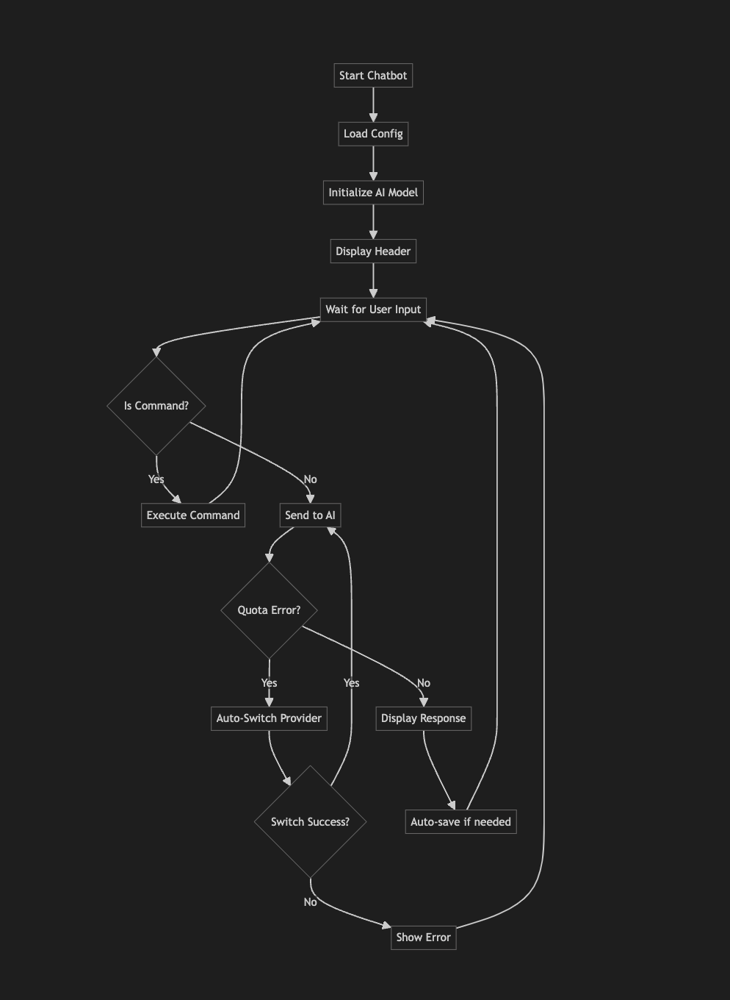

# 🤖 Universal AI Chatbot Suite

**Author: Dippu Kumar**

A comprehensive collection of AI chatbots supporting multiple providers (Google Gemini, OpenAI, Claude) with beautiful interfaces and professional architecture.

## 🖼️ Demo Preview

Here's what your chatbot will look like when it's running:


## ✨ What You Get

### 🎯 **Three Different Chatbot Versions**
1. **Simple Chat** (`g.py`) - Quick start, single interaction
2. **Enhanced Chat** (`enhanced_chat.py`) - Rich UI, conversation history
3. **Universal Chat** (`universal_chatbot.py`) - Multi-provider, professional grade

### 🤖 **Multiple AI Providers Support**
- **Google Gemini** (Default) - Fast and free
- **Groq** - Ultrafast inference with generous free tier
- **OpenAI** (GPT-3.5, GPT-4) - Industry standard
- **Claude** (Anthropic) - Advanced reasoning

### 🎨 **Beautiful Interface Features**
- ✅ Rich console UI with colors and formatting
- ✅ Conversation history and memory
- ✅ Interactive commands (`/help`, `/switch`, `/save`)
- ✅ Real-time provider switching
- ✅ **🔄 Smart Auto-Switching** (Gemini → Groq when quota exhausted)
- ✅ Auto-save conversations
- ✅ Progress indicators and spinners
- ✅ Error handling with helpful messages

### 🏗️ **Professional Architecture**
- ✅ Factory Pattern for easy model switching
- ✅ Modular design (add new providers easily)
- ✅ Configuration-driven setup
- ✅ **🧠 Intelligent Quota Management** with automatic fallbacks
- ✅ Clean separation of concerns
- ✅ Comprehensive documentation

## 📋 Prerequisites

- Python 3.9 or higher
- Google AI Studio account
- Terminal/Command Prompt access

## 🚀 Super Easy Setup (5 Minutes!)

### 📥 **Step 1: Download the Project**

**Option A: Download ZIP**
1. Click the green "Code" button on GitHub
2. Click "Download ZIP"
3. Extract to your desired folder

**Option B: Git Clone**
```bash
git clone https://github.com/kumardippu/langchain.git
cd langchain
```

### 🐍 **Step 2: Set Up Python Environment**

**Check Python Version:**
```bash
python3 --version
# Should show 3.9 or higher
```

**Create Virtual Environment (Recommended):**
```bash
# Create isolated environment
python3 -m venv .venv

# Activate it
# On Mac/Linux:
source .venv/bin/activate

# On Windows:
.venv\Scripts\activate

# You should see (.venv) in your terminal
```

### 📦 **Step 3: Install Everything at Once**

```bash
# Install all dependencies
pip install -r requirements.txt

# This installs:
# ✅ LangChain (AI framework)
# ✅ Google Gemini (default AI)
# ✅ Rich (beautiful interface)
# ✅ YAML (configuration)
# ✅ DotEnv (environment management)
```

### 🔑 **Step 4: Get Your AI API Key**

**For Google Gemini (FREE and Easy):**
1. Go to [Google AI Studio](https://aistudio.google.com/)
2. Sign in with Google account
3. Click "Get API Key" or "Create API Key"
4. Copy the key (starts with `AIzaSy...`)

**Create `.env` file:**
```bash
# Create the file
touch .env

# Add your key (replace with your actual key)
echo "GOOGLE_API_KEY=AIzaSyC-your_actual_api_key_here" >> .env
```

### 🎉 **Step 5: Run Your First Chatbot!**

```bash
# Easy launcher with menu
python3 run_chatbot.py

# Or run specific versions directly:
python3 g.py                    # Simple version
python3 enhanced_chat.py        # Enhanced version  
python3 universal_chatbot.py    # Universal version
```

## 🔑 Getting Google API Key

### Method 1: Get API Key from Google AI Studio

1. Visit [Google AI Studio](https://aistudio.google.com/)
2. Sign in with your Google account
3. Click "Get API key" or "Create API key"

### Method 2: Set Up Environment Variables

#### Option A: Using .env file (Recommended)

1. Create a `.env` file in the project directory:

```bash
touch .env
```

2. Add your API key to the `.env` file:

```env
# Google API Configuration
GOOGLE_API_KEY=AIzaSyC-your_actual_api_key_here
```

3. **Important**: Add `.env` to your `.gitignore` to keep your API key secure:

```bash
echo ".env" >> .gitignore
```

#### Option B: System Environment Variables

```bash
# Add to your shell profile (.bashrc, .zshrc, etc.)
export GOOGLE_API_KEY="AIzaSyC-your_actual_api_key_here"

# Reload your shell or run:
source ~/.zshrc  # or ~/.bashrc
```

## 🎯 Usage

### Run the Chatbot

```bash
python g.py
```

### Expected Output

```
API Key loaded: AIzaSyDpIh...

==================================================
🤖 Gemini AI Chat - Ready!
==================================================

💬 Ask me anything: What is the capital of France?

🤔 Thinking...

🤖 Gemini: The capital of France is Paris.

==================================================
```

### If No API Key is Found

If the script can't find your API key in the `.env` file or environment variables, it will prompt you:

```
GOOGLE_API_KEY not found in .env file or environment variables
Enter API key for Google Gemini: [enter your key here]
```

## 📁 Project Structure

```
langchain-gemini-chat/
├── g.py                 # Main chatbot script
├── .env                 # API key (create this)
├── .gitignore          # Git ignore file
├── README.md           # This file
└── .venv/              # Virtual environment (optional)
```

## 🔧 Troubleshooting

### Common Issues

#### 1. ModuleNotFoundError

```bash
ModuleNotFoundError: No module named 'langchain'
```

**Solution**: Install dependencies
```bash
pip install langchain langchain-google-genai python-dotenv
```

#### 2. ModuleNotFoundError: dotenv

```bash
ModuleNotFoundError: No module named 'dotenv'
```

**Solution**: Install python-dotenv
```bash
pip install python-dotenv
```

#### 3. API Key Issues

- **Error**: Invalid API key
- **Solution**: 
  1. Verify your API key is correct
  2. Check Google AI Studio for API key status
  3. Ensure no extra spaces in your `.env` file

#### 4. Python Version Issues

```bash
ERROR: Could not find a version that satisfies the requirement langchain-google-genai
```

**Solution**: Use Python 3.9 or higher
```bash
python3 --version  # Should be 3.9+
python3 -m pip install langchain-google-genai
```

#### 5. Virtual Environment Issues

If packages are installed globally but not in your virtual environment:

```bash
# Deactivate and reactivate virtual environment
deactivate
source .venv/bin/activate

# Reinstall packages
pip install langchain langchain-google-genai python-dotenv
```

### Environment Verification

Check if everything is set up correctly:

```bash
# Check Python version
python3 --version

# Check if packages are installed
python3 -c "import langchain; print('LangChain:', langchain.__version__)"
python3 -c "import langchain_google_genai; print('Google GenAI: OK')"
python3 -c "from dotenv import load_dotenv; print('python-dotenv: OK')"

# Check if API key is loaded
python3 -c "from dotenv import load_dotenv; import os; load_dotenv(); print('API Key found:', bool(os.environ.get('GOOGLE_API_KEY')))"
```

## 📚 **Choose Your Learning Path**

### 🟢 **Complete Beginner?**
→ Start with [TUTORIAL.md](TUTORIAL.md) - Step-by-step guide with screenshots

### 🟡 **Some Programming Experience?**
→ Follow the installation steps above, then try different chatbot versions

### 🔴 **Advanced Developer?**
→ Check [ARCHITECTURE.md](ARCHITECTURE.md) for technical implementation details

---

## 🎮 **Quick Start Examples**

### **Example 1: Simple Chat**
```bash
python3 g.py
```
```
💬 Ask me anything: What is the capital of France?
🤖 Gemini: The capital of France is Paris.
```

### **Example 2: Enhanced Chat with Commands**
```bash
python3 enhanced_chat.py
```
```
🤖 Enhanced Gemini AI Chat
💬 You: /help
📝 Available Commands:
   /help     - Show commands
   /clear    - Clear history  
   /save     - Save conversation
   /quit     - Exit

💬 You: Tell me about Python programming
🤖 Gemini: Python is a versatile programming language...
💬 You: /save
💾 Conversation saved to: chat_session_20241230.json
```

### **Example 3: Universal Chat (Switch AI Providers)**
```bash
python3 universal_chatbot.py
```
```
🤖 Universal AI Chatbot
Current Provider: Google Gemini

💬 You: /switch
Available Providers:
1. Gemini (Google)
2. OpenAI (ChatGPT) 
3. Claude (Anthropic)

Select provider: 2
✅ Switched to OpenAI
💬 You: Hello!
🤖 ChatGPT: Hello! How can I help you today?
```

---

## 🔄 **Smart Auto-Switching Feature**

### **Never Get Stuck by Quota Limits!**

The Universal Chatbot includes **intelligent quota management** that automatically switches AI providers when limits are reached:

#### **🎯 Smart Priority System**
- **Gemini quota exhausted** → **Groq** (Free & Ultrafast)
- **Other providers exhausted** → OpenAI → Groq → Claude → Gemini

#### **✨ Key Benefits**
- ✅ **Zero interruption** to your conversations
- ✅ **Conversation history preserved** across switches
- ✅ **Automatic fallback chain** if multiple providers fail
- ✅ **Clear notifications** about switches and reasons
- ✅ **Up to 3 retry attempts** to find working providers

#### **🔍 Smart Detection**
The system detects various quota error patterns:
- `"quota exceeded"`, `"rate limit"`, `"daily quota"`
- Gemini-specific: `"generativelanguage.googleapis.com/..."`
- OpenAI-specific: `"exceeded your current quota"`
- Provider-specific error codes and messages

#### **📱 User Experience**
When Gemini quota is exhausted, you'll see:
```
⚠️ Quota limit reached for Gemini

✅ Automatically switched to Groq (Free & Fast)

🚀 Groq offers excellent performance with generous free tier limits

💬 Your conversation history has been preserved
```

#### **🔄 How It Works - Flow Diagram**



**Flow Explanation:**
1. **🚀 Startup**: Load configuration and initialize AI model
2. **💬 User Input**: Wait for messages or commands  
3. **🤖 AI Processing**: Send message to current AI provider
4. **🔍 Error Detection**: Check if quota/rate limit error occurred
5. **🔄 Auto-Switch**: If quota error, automatically switch to next provider
6. **✅ Response**: Display AI response with beautiful formatting
7. **💾 Auto-Save**: Automatically save conversation every 10 messages

**Key Features Shown:**
- ✅ **Intelligent Decision Making**: Automatic quota error detection
- ✅ **Smart Provider Switching**: Gemini → Groq priority system
- ✅ **Conversation Continuity**: History preserved across switches
- ✅ **Robust Error Handling**: Multiple fallback options
- ✅ **User-Friendly Interface**: Commands and auto-save features

---

## 🛠️ **Adding More AI Providers**

### **Groq (Ultrafast & Free)**
```bash
# Install Groq package
pip install langchain-groq

# Get free API key from console.groq.com
# Add to .env file
echo "GROQ_API_KEY=your_groq_key" >> .env

# Update config.yaml
ai_provider:
  provider: "groq"
  model: "llama3-8b-8192"
```

### **OpenAI (ChatGPT)**
```bash
# Install OpenAI package
pip install langchain-openai

# Get API key from platform.openai.com
# Add to .env file
echo "OPENAI_API_KEY=your_openai_key" >> .env

# Update config.yaml
ai_provider:
  provider: "openai"
  model: "gpt-3.5-turbo"
```

### **Claude (Anthropic)**
```bash
# Install Claude package  
pip install langchain-anthropic

# Get API key from console.anthropic.com
# Add to .env file
echo "ANTHROPIC_API_KEY=your_claude_key" >> .env

# Update config.yaml
ai_provider:
  provider: "claude"
  model: "claude-3-haiku-20240307"
```

---

## 📂 **Project Structure**

```
📦 Universal AI Chatbot Suite
├── 🤖 Chatbot Versions
│   ├── g.py                    # Simple (single question)
│   ├── enhanced_chat.py        # Enhanced (rich UI, history)
│   └── universal_chatbot.py    # Universal (multi-provider)
├── 🏗️ Architecture
│   └── models/                 # AI provider implementations
│       ├── base_model.py       # Abstract base class
│       ├── gemini_model.py     # Google Gemini
│       ├── groq_model.py       # Groq (Ultrafast)
│       ├── openai_model.py     # OpenAI ChatGPT
│       ├── claude_model.py     # Anthropic Claude
│       └── model_factory.py    # Factory pattern
├── ⚙️ Configuration
│   ├── config.yaml             # Settings
│   ├── .env                    # API keys (create this)
│   └── requirements.txt        # Dependencies
├── 🚀 Launcher
│   └── run_chatbot.py         # Interactive menu
└── 📚 Documentation
    ├── README.md              # This file
    ├── TUTORIAL.md            # Beginner guide
    └── ARCHITECTURE.md        # Technical details
```

---

## 🔧 **Configuration Options**

### **Basic Settings (config.yaml)**
```yaml
# Choose your AI provider
ai_provider:
  provider: "gemini"           # gemini, openai, claude
  model: "gemini-1.5-flash"    # specific model
  temperature: 0.7             # creativity (0.0-1.0)
  max_tokens: 1000            # response length

# Interface preferences  
interface:
  show_timestamp: true         # show message time
  auto_save: true             # save conversations
  max_history: 20             # messages to remember

# Advanced features
features:
  streaming: false            # typing effect
  voice_input: false          # voice commands
  web_search: false           # internet access
```

### **Environment Variables (.env)**
```bash
# Required for default (Gemini)
GOOGLE_API_KEY=your_gemini_key_here

# Optional for other providers
OPENAI_API_KEY=your_openai_key_here
ANTHROPIC_API_KEY=your_claude_key_here
```

---

## 🆘 **Troubleshooting**

### **Common Issues**

| Problem | Solution |
|---------|----------|
| `ModuleNotFoundError` | Run `pip install -r requirements.txt` |
| `No API key found` | Check your `.env` file |
| `Permission denied` | Use `python3` instead of `python` |
| Slow responses | Try different model in config |
| Import errors | Recreate virtual environment |

### **Reset Everything**
```bash
# Delete virtual environment
rm -rf .venv

# Recreate from scratch  
python3 -m venv .venv
source .venv/bin/activate
pip install -r requirements.txt
```

### **Check Installation**
```bash
# Verify packages
python3 -c "import langchain; print('✅ LangChain OK')"
python3 -c "import rich; print('✅ Rich OK')"
python3 -c "import yaml; print('✅ YAML OK')"

# Test simple chatbot
python3 g.py
```

---

## 🎯 **Use Cases & Ideas**

### **Personal Use**
- 📝 Writing assistant
- 🤔 Learning companion  
- 💡 Brainstorming partner
- 🐛 Code debugging help
- 📚 Research assistant

### **Business Use**
- 📞 Customer support bot
- 📊 Data analysis helper
- 📋 Content generation
- 🔍 Document Q&A
- 🎯 Lead qualification

### **Educational Use**
- 👨‍🏫 Tutoring system
- ❓ Quiz generation
- 📖 Study companion
- 🧪 Concept explanation
- 💭 Critical thinking

---

## 🏆 **Features Comparison**

| Feature | Simple | Enhanced | Universal |
|---------|--------|----------|-----------|
| Basic Chat | ✅ | ✅ | ✅ |
| Rich UI | ❌ | ✅ | ✅ |
| Commands | ❌ | ✅ | ✅ |
| History | ❌ | ✅ | ✅ |
| Save/Load | ❌ | ✅ | ✅ |
| Multi-Provider | ❌ | ❌ | ✅ |
| Factory Pattern | ❌ | ❌ | ✅ |
| Config File | ❌ | ❌ | ✅ |
| Runtime Switching | ❌ | ❌ | ✅ |
| Production Ready | ❌ | ❌ | ✅ |

---

## 🤝 **Contributing**

Want to add features or fix bugs?

1. **Fork** the repository
2. **Create** a feature branch  
3. **Make** your changes
4. **Test** thoroughly
5. **Submit** a pull request

### **Ideas for Contributions**
- 🎤 Voice input/output
- 🌐 Web interface (Streamlit)
- 📄 Document chat (RAG)
- 🔌 API endpoints
- 🎨 New themes
- 🌍 Multi-language support
- 📱 Mobile app
- 🧠 Memory improvements

---

## 📄 **License & Credits**

### **Author**
**Dippu Kumar** - Creator and maintainer

### **License**
MIT License - Feel free to use, modify, and distribute

### **Credits**
- 🤖 **LangChain** - AI framework
- 🎨 **Rich** - Beautiful console UI
- 🧠 **Google Gemini** - Default AI provider
- 🏗️ **Factory Pattern** - Clean architecture

### **Support**
- 📧 **Issues**: GitHub Issues tab
- 💬 **Discussions**: GitHub Discussions
- ⭐ **Star**: If you find this useful!

---

## 🎉 **What's Next?**

### **Immediate Next Steps**
1. ✅ Run your first chatbot
2. ✅ Try different versions
3. ✅ Experiment with settings
4. ✅ Save interesting conversations

### **Advanced Exploration**
1. 🔄 Switch between AI providers
2. 🏗️ Study the factory pattern
3. 🛠️ Customize the interface
4. 📦 Add new providers
5. 🚀 Deploy for others to use

### **Future Possibilities**
- 🌐 Web-based interface
- 📱 Mobile app version
- 🤖 Discord/Slack bot
- 📊 Analytics dashboard
- 🔗 API service
- 🎭 Multiple personalities
- 🧠 Long-term memory
- 🌍 Multi-language support

---

**Happy Chatting! 🤖✨**

*Made with ❤️ by Dippu Kumar*

## 📚 Additional Resources

- [LangChain Documentation](https://python.langchain.com/)
- [Google AI Studio](https://aistudio.google.com/)
- [Google Gemini API Documentation](https://ai.google.dev/)
- [Python-dotenv Documentation](https://python-dotenv.readthedocs.io/)

## 📄 License

This project is open source and available under the MIT License.

## 🤝 Contributing

Feel free to submit issues, fork the repository, and create pull requests for any improvements.

---

**Happy Chatting! 🤖✨**

## Reference
https://python.langchain.com/docs/tutorials/llm_chain/